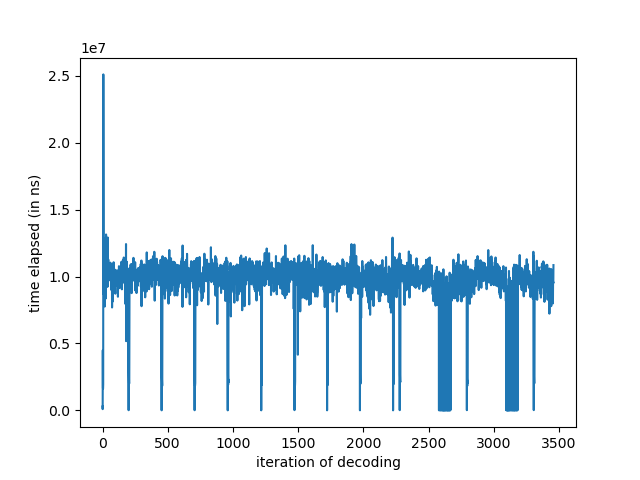
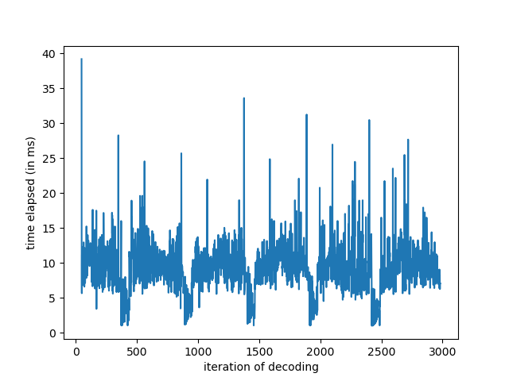

# VA-API

VAAPI (decode for now) support is provided by `cros-codecs`. 

## Debugging

Follow the instructions in `Debugging.md` to obtain a `test.h264` bitstream.

The following script uses `ccdec` to output a sequence of decoded NV12 frames from the original `test.h264` bitstream:

```bash
#!/bin/bash

# Test decode an h264 dump from remote desktop software
RUST_LOG=trace cargo run --example ccdec -- --input-format h264 --output-format nv12 <PATH TO H264 DUMP (test.h264)> --output test/test_frame --multiple-output-files
ffmpeg -f rawvideo -pix_fmt nv12 -s 1920x1080 -i test/test_frame_0 output.png
gwenview output.png
```

The `trace` logging is useful to understand what `cros-codecs` is doing under the hood.


## Performance Analyses

All metrics are in *milliseconds*.

This is VA-API's `client_backend_decode_time`.
```
$ python ../statistics/vis/time_elapsed.py ms statout/2025-11-22\ 23:59:08.164727725\ UTC/client_backend_decode_time
statistics:
	mean: 9.87310449053201
	median: 10.04709
	stddev: 1.3047565221050805
	min: 1.633589
	max: 25.088186
```



It is worth noting that it's not clear if VA-API produces a frame every time the backend (`LVVideoDecoder::decode`) `decode` function is called. 


This is OpenH264's `client_backend_decode_time`.

```
$ python ../statistics/vis/time_elapsed.py ms statout/2025-11-23\ 00:06:12.573940259\ UTC/client_backend_decode_time 
statistics:
	mean: 9.418941835336977
	median: 9.34985
	stddev: 3.2090456187117495
	min: 1.00476
	max: 39.199681
```



